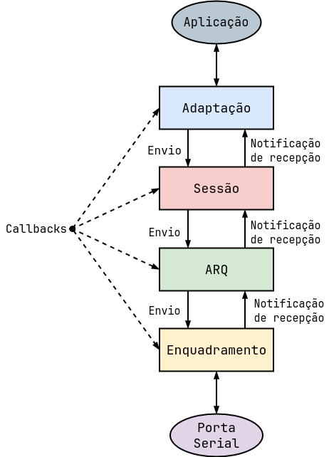
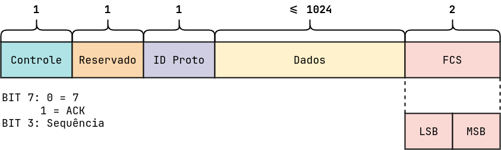

# Projeto 2 - Protocolo de Enlace <!-- omit in toc -->

**Sumário**

- [Introdução](#introdução)
- [Pré-requisitos](#pré-requisitos)
- [Modelagem do projeto](#modelagem-do-projeto)
  - [Enquadramento](#enquadramento)
  - [Arquitetura](#arquitetura)
    - [Formato de quadro do protocolo](#formato-de-quadro-do-protocolo)
  - [Sessão](#sessão)
- [Utilização do aplicativo Socat](#utilização-do-aplicativo-socat)
- [Execução do projeto](#execução-do-projeto)
  - [Instrução de uso - Sessão](#instrução-de-uso---sessão)


## Introdução

O protocolo de enlace se destina a implantar enlaces ponto-a-ponto usando um canal sem-fio. A camada física a ser utilizada é do tipo UART com encapsulamento de mensagens até 1024 bytes, recepção de mensagens livres de erros, garantia de entrega, controle de acesso ao meio e conectado (estabelecimento de sessão).
## Pré-requisitos

- [socat](http://www.dest-unreach.org/socat) (*Multipurpose relay (SOcket CAT)*)
- [Implementações de referência do protocolo](https://moodle.ifsc.edu.br/pluginfile.php/884914/mod_folder/content/0/Software/proto_com_erros.tgz?forcedownload=1)
## Modelagem do projeto
O protocolo desenvolvido se comunica por meio de um link utilizando portas seriais sendo dividido nas subcamadas de enquadramento, arquitetura, sessão e adaptação.
<p align="center">
  
</p>

### Enquadramento 

A subcamada de enquadramento é responsável por delimitar o quadro utilizando a técnica de sentinela. É utilizado flag com valor `7E` como delimitador de quadros e byte de escape `7D` para preenchimento de octeto. O transmissor deve fazer pelo menos o escape dos bytes `7E` e `7D` que aparecerem no conteúdo do quadro, o byte que sofrer o escape deve ser modificado por meio de um XOR 20.


### Arquitetura  

A subcamada ARQ envia e recebe quadros de dados e de confirmação da subcamada inferior (detecção de erros + enquadramento).


#### Formato de quadro do protocolo

Formato  para o quadro possui um cabeçalho com os seguintes campos:

- `Controle:` contém tipo de quadro (ACK ou DATA) e número de sequência (0 ou 1)
- `Reservado:` este campo fica reservado para uso futuro
- `Proto:` contém o tipo de conteúdo transportado pelo quadro
- `FCS:` contém o valor do código [CRC-16-CCITT](https://datatracker.ietf.org/doc/html/rfc1662#appendix-C), ocupa 2 bytes, sendo o primeiro o LSB e o último o MSB do código CRC, este campo é anexado pelo enquadramento na transmissão, e removido na recepção.


> OBS: Campo `Proto` existe somente em quadros do tipo DATA)

<p align="center">
  
</p>

| bit 7 | bit 6 | bit 5 | bit 4 | bit 3 | bit 2 | bit 1 | bit 0 | Tipo de mensagem |
|-------|-------|-------|-------|-------|-------|-------|-------|------------------|
| 1     | 0     | 0     | 0     | x     | 0     | 0     | 0     | ACK              |
| 0     | 0     | 0     | 0     | x     | 0     | 0     | 0     | DATA             |
| 0     | 0     | 0     | 0     | 0     | 0     | 0     | 0     | dados            |
| 0     | 0     | 0     | 0     | 0     | 1     | 0     | 0     | CR               |
| 0     | 0     | 0     | 0     | 0     | 1     | 0     | 1     | CC               |
| 0     | 0     | 0     | 0     | 0     | 1     | 1     | 0     | DR               |
| 0     | 0     | 0     | 0     | 0     | 1     | 1     | 1     | DC               |
| 0     | 0     | 0     | 0     | 0     | 0     | 1     | 1     | KA               |
>Os bits 0, 1  e 2 do campo de controle representam as mensagens de controle do gerenciamento de sessão.
### Sessão 

Na subcamada é adicionado a funcionalidade para estabelecer, manter e terminar conexões.

O serviço implementado nessa subcamada está definido desta da seguinte forma:

- `Estabelecimento de conexão:` feita em três vias, sendo um dos lados do enlace chamado de `INICIADOR`, e o outro de `PASSIVO`, o papel deste  são definidos quando o protocolo é iniciado.
- `Terminação de conexão:` feita em três vias, porém, qualquer um dos lados pode iniciar a terminação.
- `Manutenção de conexão:` feita por ambos lados do enlace, sempre que o enlace ficar ocioso mais que um certo tempo.


## Utilização do aplicativo Socat

Para utilizar o protocolo, é possível executar em um computador com Linux o aplicativo [socat](http://www.dest-unreach.org/socat) (*Multipurpose relay (SOcket CAT)*) para fazer o encaminhamento entre dois pseudoterminais. Essa abordagem permite a comunicação serial entre dois terminais.

1. Instale o `socat` com o seguinte comando
    ```bash
    sudo apt install socat
    ```
2. Execute o `socat` para criar um *relay* entre dois pseudoterminais (`/dev/pts`).  **Atenção:** é necessário deixar o `socat` em execução.
    ```bash
    socat -d -d pty,raw,echo=0 pty,raw,echo=0
    ```
    
    - Após executar o código acima será impresso os pseudoterminais que foram associados. No exemplo abaixo foi criado um *relay* entre os pseudoterminais `/dev/pts/7` e `/dev/pts/8`.
        ```bash
        2023/06/05 10:33:33 socat[162663] N PTY is /dev/pts/7
        2023/06/05 10:33:33 socat[162663] N PTY is /dev/pts/8
        2023/06/05 10:33:33 socat[162663] N starting data transfer loop with FDs [5,5] and [7,7]
        ```
    - Um dos pseudoterminais será usado em um terminal (e.g. `/dev/pts/7`) e o outro (e.g. `/dev/pts/8`) será usado por outro terminal para ser possível a comunicação. 

## Execução do projeto

1. Instale os requisitos do projeto:
  
    ```bash
    python3 -m venv venv
    source venv/bin/activate
    pip3 install -r requirements.txt
    ```

2. Execute o socat como exemplificado na seção [Utilização do aplicativo Socat](#utilização-do-aplicativo-socat) escolha um pseudoterminais para executar o projeto deste repositório e o outro para executar implementações de referência do protocolo.


3. O projeto de enlace na raiz deste repositório pode ser executado das seguintes formas:

- Com todas as camadas `python main.py <Porta serial>`. Exemplo abaixo
  ```bash
  python3 main.py 5
  ```

- Com camadas até a subcamada enquadramento `python main.py <Porta serial> untilEnq`. Exemplo abaixo

  ```bash
  python3 main.py 5 untilEnq
  ```

- Com camadas até a subcamada ARQ `python main.py <Porta serial> untilArq`. Exemplo abaixo

  ```bash
  python3 main.py 5 untilArq
  ```
> Caso a digite `!DR` será enviado o comando DR para a outra ponta

> Caso digite `!fail` a conexão será perdida sem avisar o outro lado

4. Para os testes use a implementações de referência do protocolo, com as opções de linha de comando necessárias ou desejadas.

    ```bash
    aluno@M1:~$ ./proto -h
    Uso: ./proto_noarq --serialPath /dev/XXX [opções] | -h

    Opções:
    --debug: ativa debug em todas as subcamadas
    -h: mostra esta ajuda

    Opções relacionadas a Sessão:
    --idSession ID: define o número do id de sessão entre 0 e 255. default: 0
    --master: define como iniciador de sessao
    --noSession: desativa o controle de sessão
    --idError T: frequência de erros de id de sessão (1 a cada T mensagens com id sessão errado)
    --debugSession: ativa mensagdens de debug de sessão

    Opções relacionadas a ARQ:
    --noArq: desativa o ARQ
    --ackError T: frequência de erros de Ack (1 a cada T ACK recebidos são descartados)
    --dataError T: frequência de erros de DATA (1 a cada T DATA recebidos são descartados)
    --maxRetries N: limite de retransmissões do ARQ (default: 3)
    --ackTimeout T: timeout de espera por ACK no ARQ, em milissegundos (default: 1000)
    --debugArq: ativa mensagdens de debug de Arq

    Opções relacionadas a Enquadramento:
    --noFcs: desativa a detecção de erros
    --fcsError T: frequência de erros de FCS (1 a cada T quadros transmitidos com erro proposital)
    --flagError T: frequência de erros de Flag (1 a cada T flags omitidas propositalmente)
    --mtu N: valor da MTU (default: 1024)
    --debugEnq: ativa mensagens de debug de Enquadramento
    ```

### Instrução de uso - Sessão

1. Caso esteja utilizando a camada de sessão, para iniciar a comunicação deve ser pressionado `ENTER`.
2. Caso envie a mensagem `!DR` será enviado o comando DR para a outra ponta
3. Caso envie a mensagem `!fail` a conexão será perdida sem avisar o outro lado

